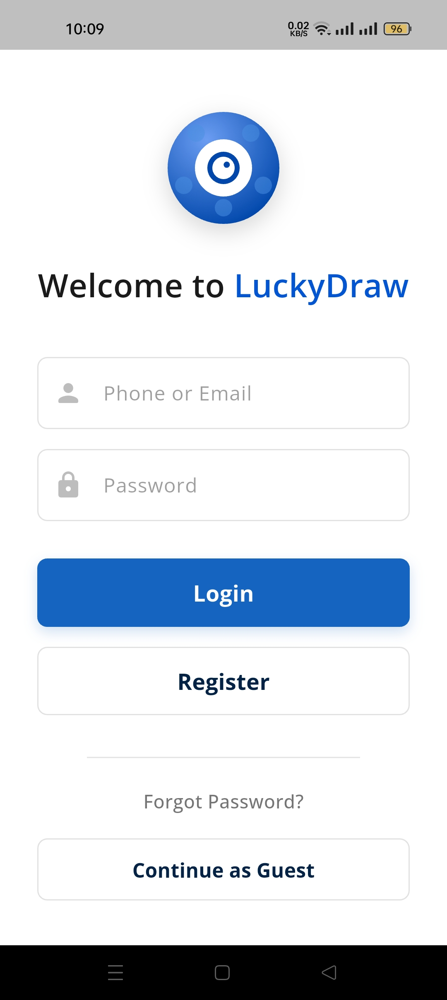
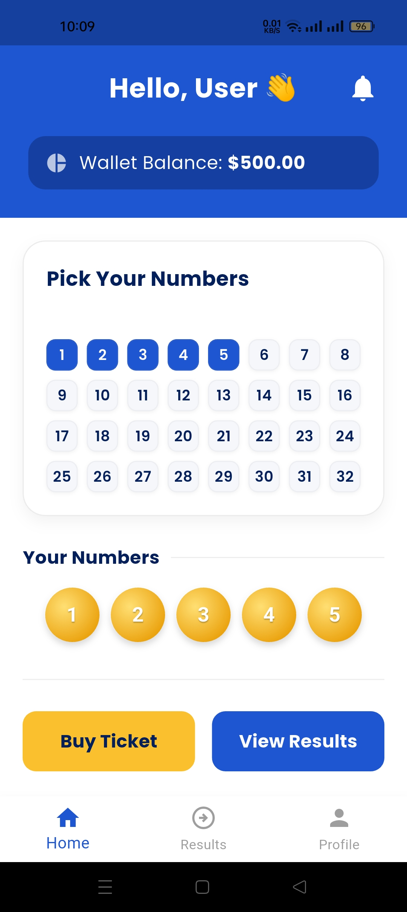
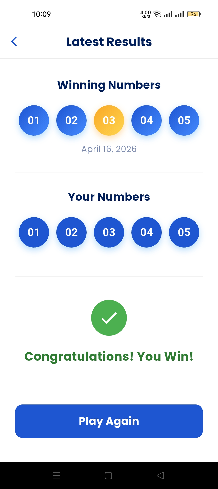
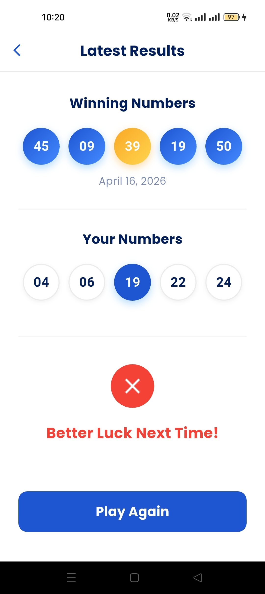

# LuckyDraw - A Premium Lottery Application

LuckyDraw is a modern, high-performance lottery application built with **Flutter**. It demonstrates professional software engineering practices including **Clean Architecture**, robust state management with **Provider**, and a vibrant, user-centric UI.

---

## 📱 App Screenshots

<div align="center">

| Entry Screen | Number Selection | Game Play | Results |
| :---: | :---: | :---: | :---: |
|  |  |  |  |

</div>

---

## ✨ Key Features

- **Wallet System**: Start with a virtual balance and track your winnings.
- **Interactive Number Selection**: Choose up to 5 lucky numbers from a grid of 50.
- **Real-time Fairness**: Winning numbers are generated using a cryptographically secure-like random system.
- **Clean Animations**: Smooth transitions and micro-interactions for an enhanced user experience.
- **Theme Support**: Premium look and feel with modern typography (Google Fonts).

---

## 🏗️ Architecture & State Management

The project follows **Clean Architecture** principles to ensure scalability and maintainability:

- **Presentation Layer**: UI widgets and Providers.
- **Core**: Constants and shared utilities.
- **Provider**: Used for reactive state management (`LotteryProvider`).

### Folder Structure
```text
lib/
├── core/               # App constants and shared utilities
├── presentation/
│   ├── pages/          # UI Screens (Entry, Home, Results)
│   └── providers/      # State Management logic
└── main.dart           # App entry point
```

---

## 🛠️ Tech Stack

- **Flutter**: UI Framework.
- **Provider**: State Management.
- **Google Fonts**: Modern Typography.
- **Intl**: Formatting and Internationalization.
- **Equatable**: Value equality for clean object comparison.

---

## 🚀 Getting Started

### Prerequisites
- [Flutter SDK](https://docs.flutter.dev/get-started/install) installed.
- A mobile emulator or physical device.

### Running the App
1. Clone the repository:
   ```bash
   git clone [repository_url](https://github.com/margaretjconn528/Assignment)
   ```
2. Install dependencies:
   ```bash
   flutter pub get
   ```
3. Run the application:
   ```bash
   flutter run
   ```

---

## 📝 License
This project is for educational purposes. Feel free to use and modify it.

